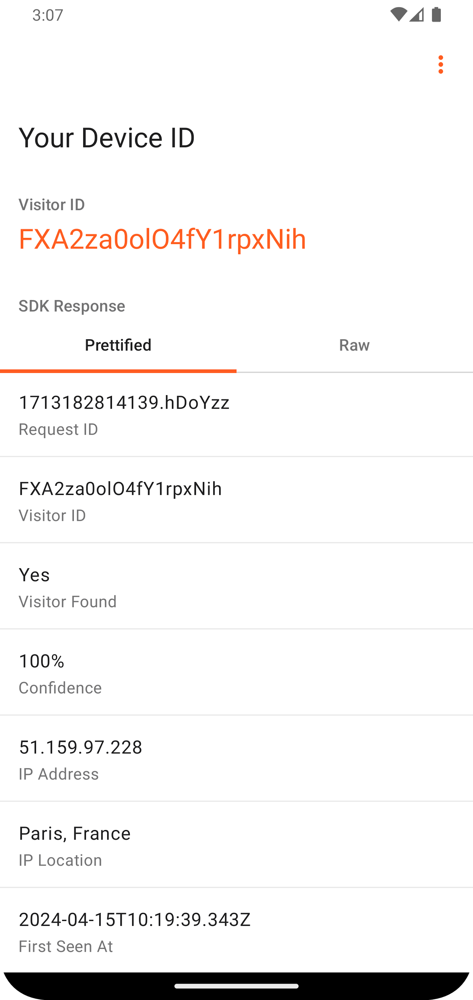

<p align="center">
    <picture>
      <source media="(prefers-color-scheme: dark)" srcset="resources/logo_light.svg" />
      <source media="(prefers-color-scheme: light)" srcset="resources/logo_dark.svg" />
      
    </picture>
</p>

<p align="center">
  <a href="https://discord.gg/39EpE2neBg">
    
  </a>
    <a href="https://android-arsenal.com/api?level=21">
    
  </a>
  <a href="https://github.com/fingerprintjs/fingerprintjs-pro-android-demo/releases/tag/v2.4.0">
    
  </a>
</p>

<p align="center">
 	<a href='https://play.google.com/store/apps/details?id=com.fingerprintjs.android.fpjs_pro_demo'>
 		
 	</a>
 </p>

<p align="center">
  
  
  
  
</p>

# Fingerprint Pro Android Demo
[Fingerprint’s Device Intelligence platform for Android](https://dev.fingerprint.com/docs/native-android-integration) helps you to accurately identify the devices on which your mobile app is being used. The platform also provides high-quality [Smart Signals](https://dev.fingerprint.com/docs/smart-signals-overview#smart-signals-for-mobile-devices) that will help you identify risky transactions before they happen. The Fingerprint Pro Demo App for Android allows you to effortlessly experience the capabilities of our device intelligence platform.

## About

This repository contains the source code for the Fingerprint Pro Demo App for Android. It shall serve as a good example

- For integrating the Fingerprint Identification SDK in your Android app, complimenting our [Getting Started Guide](https://dev.fingerprint.com/docs/android-sdk);
- For best practices to follow when using the Fingerprint Identification SDK in your app.

## Install the app

You can install the app using one of the following methods:
1. Install from [Google Play](https://play.google.com/store/apps/details?id=com.fingerprintjs.android.fpjs_pro_demo)
2. Download and install .apk file from the [Releases page](https://github.com/fingerprintjs/fingerprint-device-intelligence-android-demo/releases)
3. [Build the app from sources](#build-the-app-from-sources)

## Build the app from sources

Build the app from sources in a few simple steps:

1. Clone the repository:
```sh
git clone https://github.com/fingerprintjs/fingerprint-device-intelligence-android-demo.git
```
2. Open up the cloned repository in Android Studio
3. Open up the `app/src/main/java/com/fingerprintjs/android/fpjs_pro_demo/constants/Credentials.kt` file and assign your Public API Key and Endpoint URL accordingly:
```kotlin
import com.fingerprintjs.android.fpjs_pro.Configuration

object Credentials {
    val apiKey: String = "your_api_key"
    val endpointUrl: String = Configuration.Region.US.endpointUrl
}
```
You can find the Public API Key in your [dashboard](https://dashboard.fingerprint.com/) at `App Settings` > `API Keys`.
> [!NOTE]
> The `debug` and `releaseLocalSign` variants of the app contain a button inside the app bar allowing you to stub the response of the Fingerprint Pro SDK. This might be useful in case you don't want to setup your own API key and region, but still want to check out how the UI of the app looks like on your device.
4. In "Build Variants" tool window, select either `debug` or `releaseLocalSign` build variant
> [!NOTE]
> There is also `release` variant for the internal use. It's very similar to `releaseLocalSign`, but signs the app with another signature and disables the stubbing functionality described above.
5. Run the app on the selected device

## License

The source code in this repository is licensed under the [MIT license](LICENSE).
